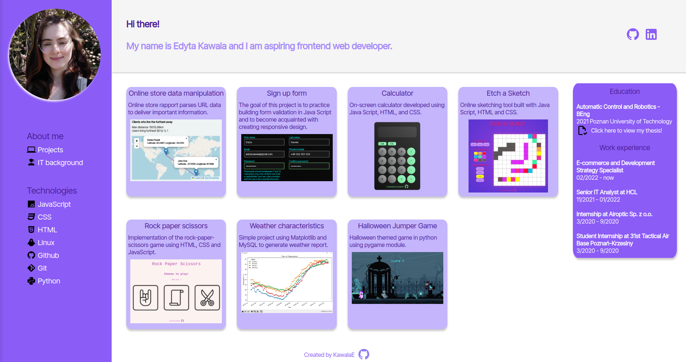

Admin dashboard-inspired page that displays all my recent projects.

<h2><a href="https://kawalae.github.io/Project-dashboard/">Click here to view!</a></h2>

<h2>Technologies used: <h2>

<h2>Project description</h2>

   

<h2>Acknowledgements:</h2>
<ul>
    <li><a href="https://tailwindcss.com/docs/customizing-colors">Tailwindcss</a></li>
    <li><a href="https://undraw.co/license">Page Icon</a></li>
    <li><a target="_blank" href="https://icons8.com/icon/21278/css3">CSS3</a> icon by <a target="_blank" href="https://icons8.com">Icons8</a></li>
    <li><a target="_blank" href="https://icons8.com/icon/PXTY4q2Sq2lG/javascript">JavaScript</a> icon by <a target="_blank" href="https://icons8.com">Icons8</a></li>
    <li><a target="_blank" href="https://icons8.com/icon/v8RpPQUwv0N8/html-5">Html 5</a> icon by <a target="_blank" href="https://icons8.com">Icons8</a></li>
    <li><a href="https://pictogrammers.com/library/mdi/">Pictogrammers</a> 
  </li>
</ul>
